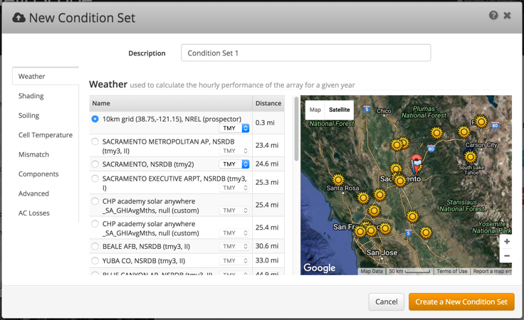
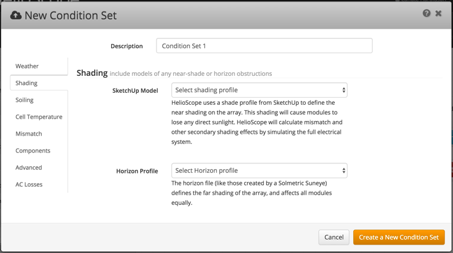
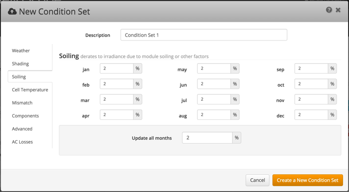
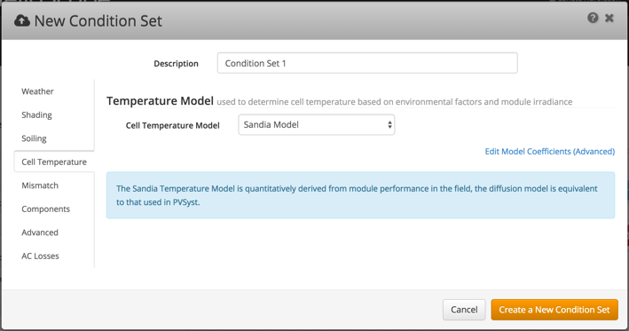
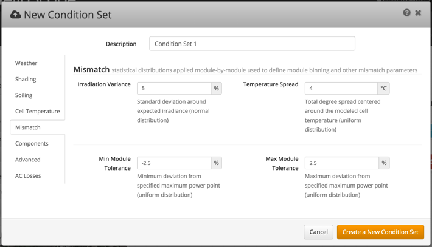
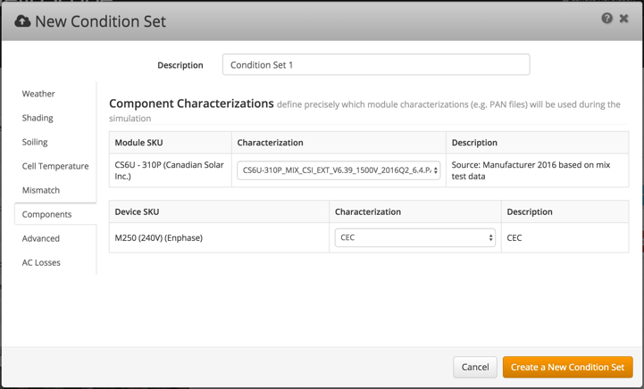
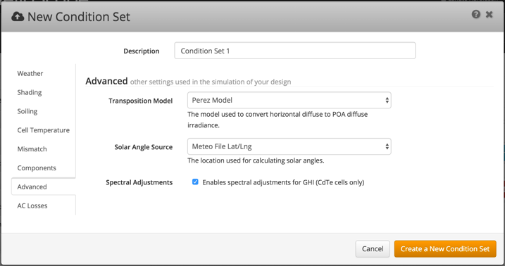
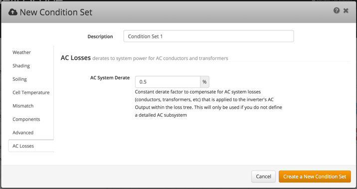

# Condition Set {#condition-set}

A Condition Set describes the environment around the solar array, such as weather conditions and soiling losses. All Projects will have a default Condition Set when first created, though this can be edited (or a second Condition Set created).

**Weather**

1.  Nearby weather stations are shown on the map in the area the project was created
2.  Weather stations are sorted by distance from the Project. The source and class of each file is shown in parenthesis. The class of the weather file can be selected in some cases when more than just a single data source is available for that location / source type.
3.  Select the desired weather file using the radio buttons

**Shading**

If a project has shading that the user would prefer to model with external shading systems, they can choose a SketchUp shade profile and/or horizon profile rather than use the integrated shading in HelioScope. For SketchUp shade profiles to be used, they must first have been loaded accorded to the process contained in our SketchUp integration manual: [http://www.folsomlabs.com/content/resources/sketchup-manual.pdf](http://www.folsomlabs.com/content/resources/sketchup-manual.pdf)

**Soiling**

Soiling and other module losses/gains in energy can be accounted for in the Soiling table. Months can be edited individually or as an entire year.

**Cell Temperature Model**

HelioScope supports both the Sandia Labs Temperature Model and the Linear Diffusion model used by PVSyst. Either temperature model can be chosen here, and the coefficients of these models can be edited by clicking “Edit Model Coefficients”.

**Mismatch**

Module mismatch can be viewed and modified using three statistical mismatch parameters:

1.  Difference in plane-of-array irradiance (normally distributed)
2.  Module temperature differences (uniform distribution)
3.  Module manufacturing tolerance (uniform distribution). This has two inputs to account for positive-tolerance module binning.

**Components**

HelioScope allows the user to manage the mathematical characterizations used for each module or inverter. The user will see:

1.  A list of all modules used on any Design in the Project
2.  If multiple characterizations are available, the user can choose which characterization they would like to use via the drop down menu. See section 7 for additional information on managing component characterizations.

**Advanced**

1.  The user can choose the transposition model (the mathematics used to convert diffuse light to POA irradiance).
2.  Solar Angle Source will let the user choose the location for calculating solar angles (either the location of the weather file, or the project location).
3.  Spectral adjustment is an adjustment to GHI irradiance for CdTe modules.

**AC System Losses**

If a full AC system is not desired, a constant derate factor can be applied to account for AC system losses. This value will only be defined if you do not define an AC subsystem.