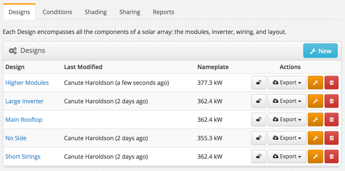
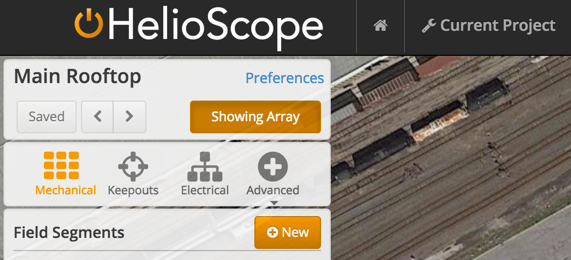

# Design {#design}

A Design contains the physical layout of a solar array, including the detailed module layout, orientation, roof shape, and surrounding obstructions. It also includes the electrical design, including wires and inverters.

Click on the blue “New” button to create a new Design.

A Project can have multiple Designs. Often these multiple designs are used to compare design alternatives. Use cloning to create multiple Designs for detailed engineering analysis and comparison (e.g. ground coverage ratio, tilt, conductor size, etc.).

A Design requires both a Mechanical layout and an Electrical design to finish and generate a report. The respective elements can be selected in the top left corner of the designer.