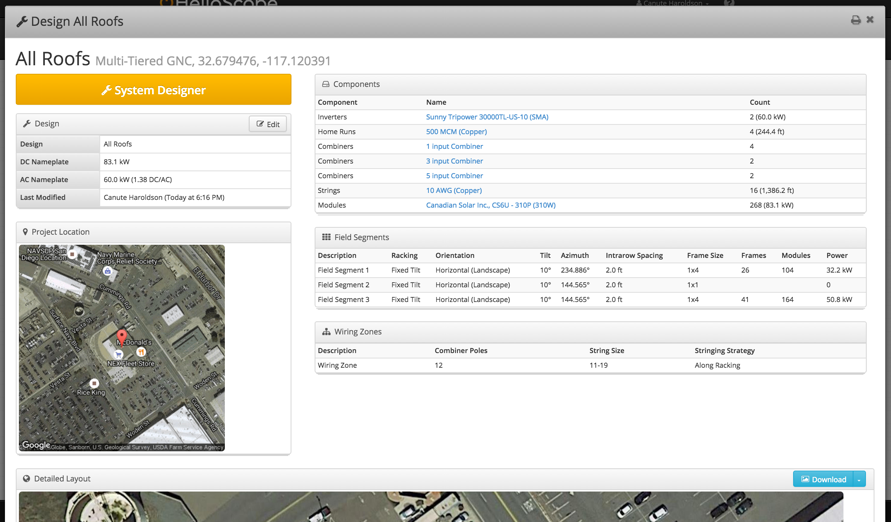
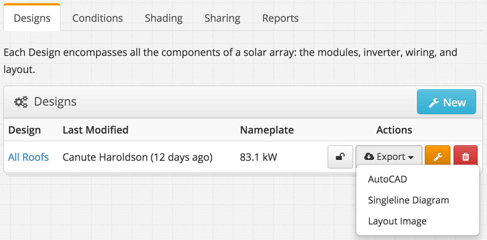

## Design Outputs {#design-outputs}

From the Project Overview, click the blue name of a Design to view the details:

1.  Design name and size
2.  Bill of Materials
3.  Field Segment
4.  Wiring Zones
5.  Detailed Layout
6.  Configurable list of Design details to be shown in image

Designs within a project have a number of exports that users can download:

1.  AutoCAD – A CAD diagram of the mechanical design (.dxf format)
2.  Single-line Diagram – The Single Line Diagram of the electrical design (.dxf format)
3.  Layout Image – A detailed image of the project

