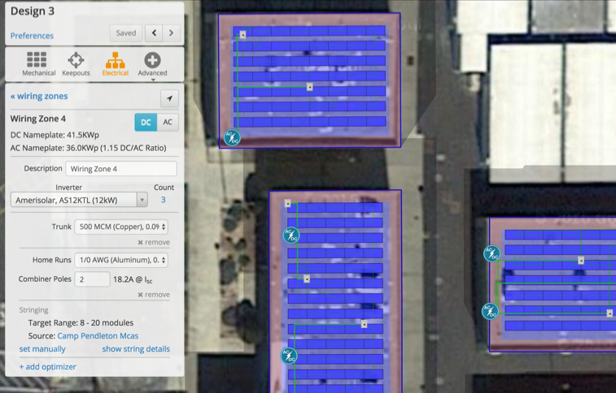

## Electrical Design {#electrical-design}

An Electrical Design completes the Mechanical Layout by generating stringing and connecting inverters to the wiring zones. Select the “Electrical” icon for the electrical layout:

1.  Choose the inverter (the quantity will automatically update based on a target DC/AC ratio)
2.  Combiners can be sized using the “Combiner Poles” field, which controls the maximum number of inputs available per combiner. These can also be removed by clicking “x remove” at the bottom of the section in the designer.
3.  Set the string size automatically based on the ASHRAE temperature data, or manually size it according to your project specifications.
4.  (optional) When designing with SolarEdge inverters, you must select an optimizer to complete the electrical design
5.  Inverters and combiner boxes can be moved on the map, and the wires will be re-routed appropriately
6.  Percentage values next to the conductors show their total voltage drop based on the array’s STC voltage and current, and the wire quantity and resistance.

**(Optional) AC Design**

HelioScope includes an optional AC Design. Note that when the AC design is incorporated, the simulation will ignore the AC losses assumed in the Condition Set.

AC Designs can be modified in a few ways:

1.  **AC Subsystem** contains the main assumptions for the AC subsystem, including the AC and PCC home run wire types, and the number of inputs for the AC panel.
2.  **Remove** to remove the AC Design, and use the Condition Set assumptions for AC loss.
3.  **Configure Transformers** allows the user to add a transformer to the design in instances where they have irregular voltages, or when a system naturally requires a transformer.
4.  **Point of Grid Interconnection** is represented by the red marker, and can be dragged around the map to define the interconnection panel for AC conductor (and loss) calculations.

**(Optional) Single Line Diagram**

HelioScope includes an automatically-generated Single Line Diagram (currently in beta). Once the mechanical and electrical designs have been completed, an SLD will be automatically created. To access it, click on the SLD button in the top right of the designer. The design will automatically update to any changes made in both the mechanical and electrical part of the design.

**Glossary: Electrical Layout**

| **Term** | **Description** |
| --- | --- |
| Trunk (optional) | The conductor size between the re-combiner box and the inverter. If no re-combiner has been configured, this is not used. |
| Home Run (optional) | The conductor size between each combiner box and the inverter or recombiner |
| Combiner Poles | The target maximum number of strings connected to each combiner box. |
| String Sizing | The range of string sizes the design will accept for stringing. Note that if a range of string sizes is allowed, then HelioScope will use mismatched strings to connect all modules in the array. |
| Stringing (under details) | The user can choose whether they would like stringing set to go up and down or along the racking for the project |
| Strings (under details) | The size of the conductor for the source circuits from the modules to the combiner or inverter |

