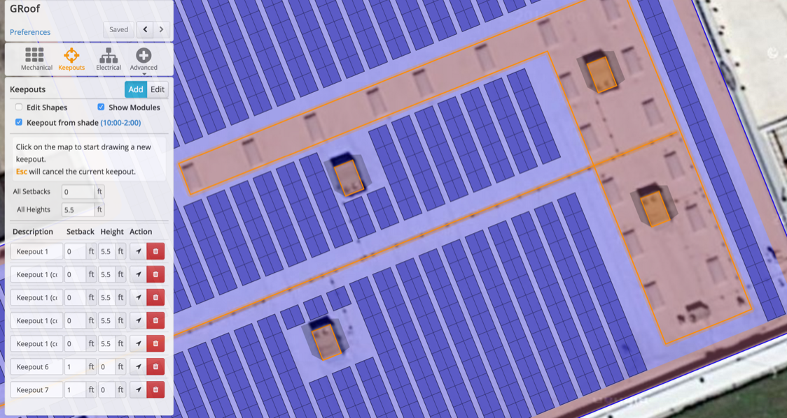

## Keepouts and Shade Objects {#keepouts-and-shade-objects}

Keepouts can be used to define both areas where modules should not be placed, and objects near an array that will cast shade on the modules.

1.  Draw Keepout shapes on the map. Each Keepout can have a setback distance for mechanical clearance, and a height associated with it to model the shade patterns.
2.  Copy a Keepout by switching to “Edit” mode, clicking the Keepout to select it, then holding the Alt key while dragging it.
3.  Define time range for generating shade patterns Keepouts. The default behavior will remove modules that are shaded at this day and time.
4.  (optional) Check or uncheck the “Keepout from Shade” box to remove or place modules in shaded areas during the time range you have set (typically a precursor to the Shade Optimization in section 4.5).

