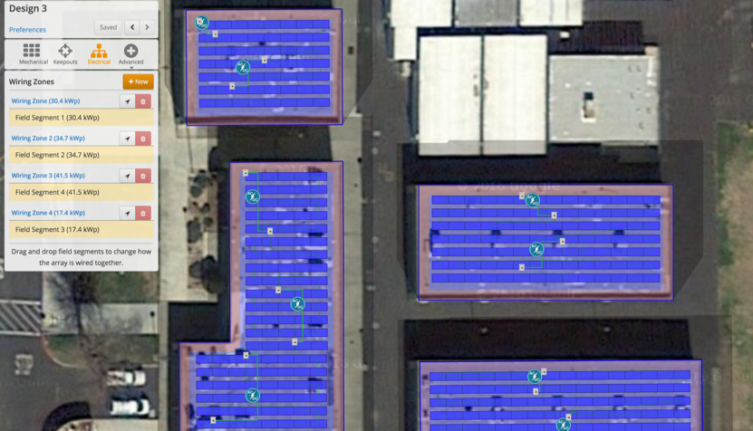
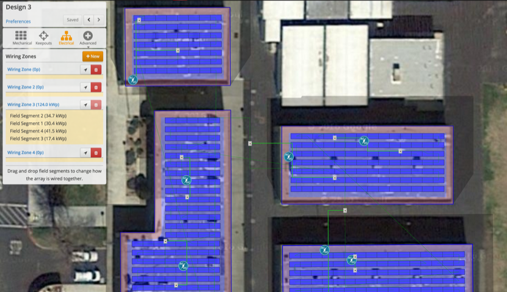

## Managing Multiple Field Segments and Wiring Zones {#managing-multiple-field-segments-and-wiring-zones}

If the Design has multiple Field Segments, they can either be wired in one Wiring Zone or multiple Wiring Zones. Click the “&lt;&lt; wiring zones” link at the top of the Electrical control.

With one Wiring Zone selected, all modules in the Field Segments will be assigned to strings as one group, and connected to the inverter(s). In this case, modules will be assigned to strings in the order that the Field Segments are listed.

When Field Segments are assigned to separate Wiring Zones, each electrical Wiring Zone is independent.

