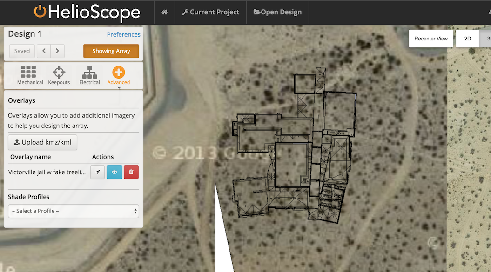

## Mechanical Layout {#mechanical-layout}

A Mechanical Layout is based on Field Segments that define areas to be filled with modules, and Keepouts which define areas to be excluded.

**Generating a Field Segment**

1.  Click points on the map to define the corners of a new Field Segment
2.  Define module layout &amp; racking assumptions
3.  If desired, set the maximum system size for the field segment
4.  Every line segment has a grey circle at its midpoint that can create a new point when dragged
5.  Right-click a point on a Field Segment to delete that point

**Setting Azimuth**

The Azimuth defines the orientation of the modules (following a compass, where 90° is east, 180° is south, and 270° is west. Right-click the edge of a Field Segment to automatically set the module orientation to face that edge of the building.

**Field Segment Height**

Field Segment height and tilt (when racking set to “Flush Mount”) can be used to create sophisticated models of rooftop environments.

**Spacing Metrics**

There are several ways to define the spacing between modules:

1.  **Row Spacing** is the edge-to-edge spacing between rows (in the N/S direction).
2.  **Module Spacing** is the distance between modules on every side of each module, and is generally used to define the spacing needed for module clips or similar items

Row spacing can be set directly, or calculated through these metrics:

*   **Span / Rise** defines the ratio of the distance between rows versus the height at the back of the module bank
*   **Ground Coverage Ratio (GCR)** is the ratio of module area divided by the surface area covered by the array
*   **Time of Day** specifies a day and time range the modules will not shade one another, based on sun angles at the project location

For ground-mounted arrays, Frames become more prominent, and Frame Spacing becomes useful.

1.  **Frames** are blocks of modules for layout, sometimes known as tables. **Frame Spacing** is the edge-to-edge spacing between frames (in the E/W direction), commonly incorporated for thermal expansion.

****

For dual tilt (“East west”) systems, the user has two more inputs for spacing:

1.  **Frame Spacing** now controls the distance between modules in the North/South direction, separating blocks of modules in the same row
2.  **Dome Spacing** controls the gap at the peak of the dome, where the modules meet to form the high point of their connection

**Alignment**:

Modules in the Field Segments can be aligned to the left, aligned to the right, staggered, or justified.

****

Justified

Right Align

Staggered

Left Align

**Field Segment Editing**

Right click on a Field Segment for a menu of advanced controls:

*   Select **Move** to drag the entire Field Segment
*   **Copy** to copy the field segment, then drag and click again to place the second Field Segment
*   Select **Align Modules to Click**, and the modules will align the top left corner of a module to the point that was clicked
*   **Remove this Module** to remove or restore an individual module

**Generating a Keepout Zone**

1.  (optional) Toggle “Showing Array / Hiding Array” by clicking on the button in the top left of the page. This button can also be toggled by pressing shift + spacebar
2.  Draw Keepout shapes on the map for the appropriate obstructions. While in Keepout mode, you can also remove modules from the design by right-clicking
3.  Switch to Edit mode to move or copy the Keepouts
4.  (optional) Define setback distance for buffer around the perimeter of Keepout
5.  (optional) Define height of the object for shade calculations
6.  Define day and time range for generating shade pattern Keepouts
7.  (optional) Check or uncheck the “Keepout from shade” box to remove or place modules in shaded areas during the time range

**3D View**

HelioScope gives users the option of viewing their designs in 3D mode. With the 3D button selected, hold down shift and click and drag to rotate the design.

**Glossary: Mechanical Layout**

| **Term** | **Description** |
| --- | --- |
| Racking type | Indicates whether modules are mounted in fixed-tilt racking on a flat plane, or are mounted flush to a roof in the same plane. This affects the row-to-row shading (zero for flush-mount), and the thermal coefficients (thermal losses will be higher in flush-mount). |
| Height | The height of the field segment, from ground to the rooftop (or to the lowest edge for flush-mount systems) |
| Azimuth | The orientation angle of the modules, following a compass: 90 degrees is East, 180 degrees is South, and 270 is to the west |
| Tilt | The angle of inclination of the modules. Zero is flat. |
| Orientation | The direction that the modules are mounted in the racking, either vertical (portrait), horizontal (landscape), or dual tilt (east/west). |
| Frame Size | The number of modules in each frame, including the vertical (“up”) and horizontal (“wide”) size |
| Row Spacing | The distance from the back of one bank of modules to the front of the next bank |
| Module Spacing | The distance between adjacent modules in the same frame |
| Frame Spacing | When not in dual tilt, this affects the distance from the side of one bank of modules to the side of the adjacent bank |
| Setback | The area around the perimeter of the Field Segment or Keepout that is off-limits to modules |
| Alignment | Depending on the selected mode, modules will align themselves within the field segment differently either to the left, centered, justified, or to the right |