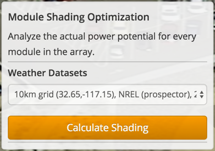
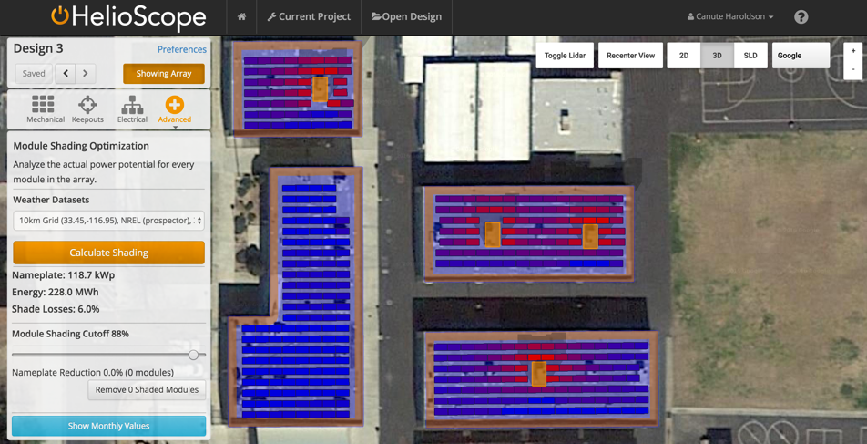
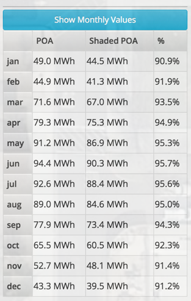

## Shade Optimization {#shade-optimization}

HelioScope enables users to analyze the impact of obstructions on the production of the Design using the Shade Optimizer (under the Advanced menu):

1.  Select the weather file to be used for the shade calculations, and click the orange “Calculate” button to initiate the Shade Optimization. This calculates the shading losses for each module (based on when they are shaded, and the direct irradiance during those hours), and presents the results as a heatmap.
2.  The **Module Cutoff Slider** allows users to set a maximum acceptable shade loss for the array. Any modules with shade losses greater than the threshold will be removed (so lower shade threshold values will remove more modules). Click “Remove” beneath the slider to remove the modules. Removed modules will be visible greyed out in the array map, and the details on the new system size and energy yield will be shown in the menu.
3.  Select **Show Monthly Values** to see the shade losses each month.