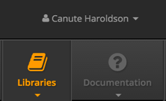

# Libraries {#libraries}

HelioScope includes four different library databases: Modules, Inverters/Optimizers, Wires, and Meteo Files.

Modules and inverters are organized hierarchically, with “SKUs” and “Characterizations”. The SKU represents the product (e.g. a Trina PC14 280-watt module). Each SKU can have multiple characterizations, which define the product’s behavior. For a module, a PAN file is a characterization, so a single module SKU can have multiple PAN files.