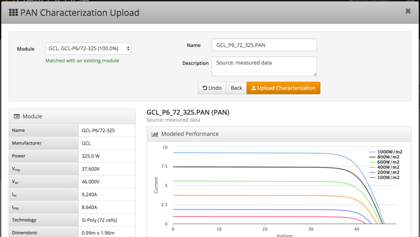

## Characterization Preview &amp; Editing {#characterization-preview-editing}

The PAN characterization page shows the PAN details:

1.  Modules that are updated will be private to the user or team who uploaded the component.
2.  The PAN details (coefficients and curves) are shown for confirmation
3.  Edit the characterization name, description, and module SKU

