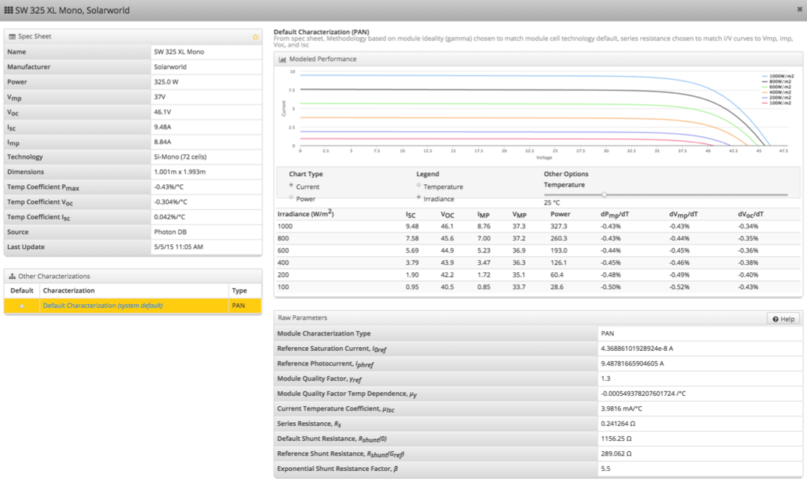

## Component Detail {#component-detail}

HelioScope provides a detailed view of modules and inverters:

1.  Key “datasheet” specifications are shown on the left – these are associated with the SKU
2.  Toggle the orange star to make the product a favorite
3.  Choose the temperature and irradiance levels for viewing the I-V or P-V curves
4.  If multiple characterizations are available for the product, choose the default characterization. These can still be modified in the Condition Set of the Project
5.  The details of the module PAN file characterization are shown in the “Raw Parameters” table

