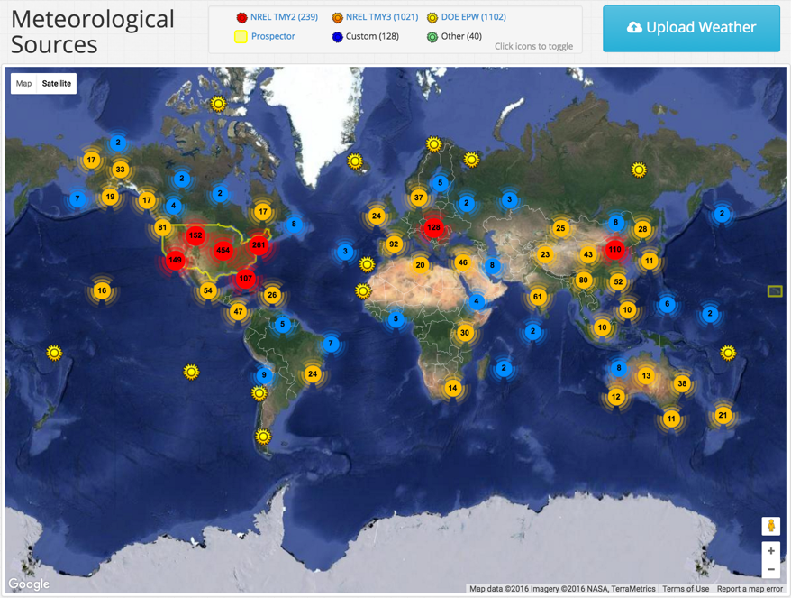

## Meteo Library {#meteo-library}

HelioScope provides a range of meteorological sources across the world. In particular, the program is compatible with TMY3, TMY2, EPW, and Prospector weather files. Users can navigate through the map to see where weather files are located from a physical view. If the weather files present in HelioScope are not appropriate for an area, users can upload their own weather files within the Meteo Library. The process for uploading these files is detailed here: [https://www.dropbox.com/s/3a31dsna8c3socp/%20weather%20file%20upload%20v0.1.pdf?dl=0](https://www.dropbox.com/s/3a31dsna8c3socp/%20weather%20file%20upload%20v0.1.pdf?dl=0)

