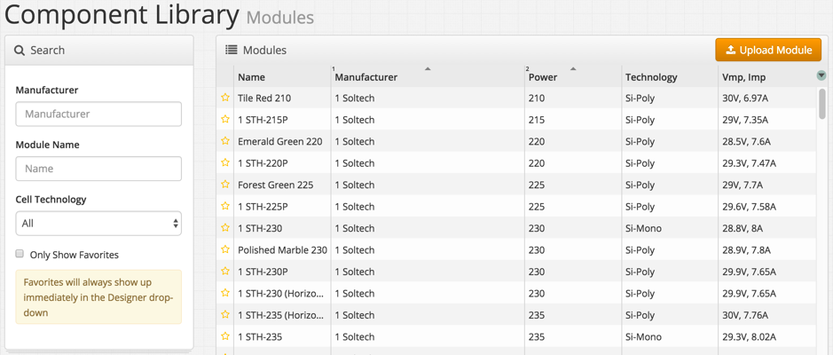
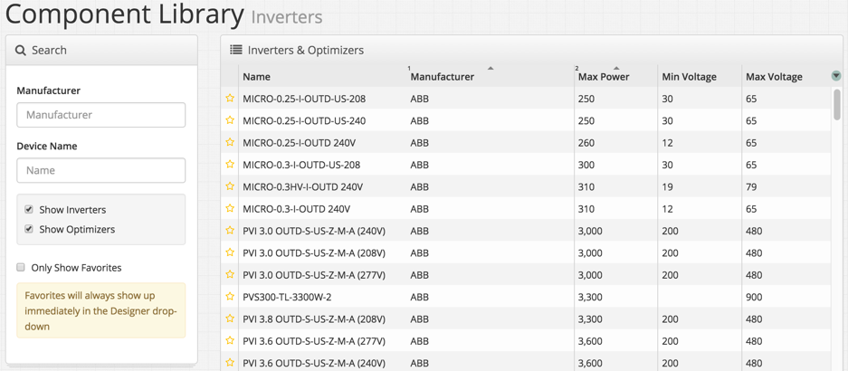

## Module and Inverter Libraries {#module-and-inverter-libraries}

1.  Access the module or inverter library from the library menu in the top right of the page
2.  Specific products can be searched for by Manufacturer, Module Name, and Cell Technology
3.  Click on any module or inverter to view its characteristics
4.  PAN files for Modules can be privately uploaded if they are saved in a version of PVSyst 6.4 or later. You can find the documentation to upload PAN files here: [https://www.dropbox.com/s/cimah8wdx0ahpq2/%20PAN%20file%20upload%20v0.1.pdf?dl=0](https://www.dropbox.com/s/cimah8wdx0ahpq2/%20PAN%20file%20upload%20v0.1.pdf?dl=0)
5.  Click the orange star to “favorite” a device so it will show up automatically on the drop-down menu in the Designer

