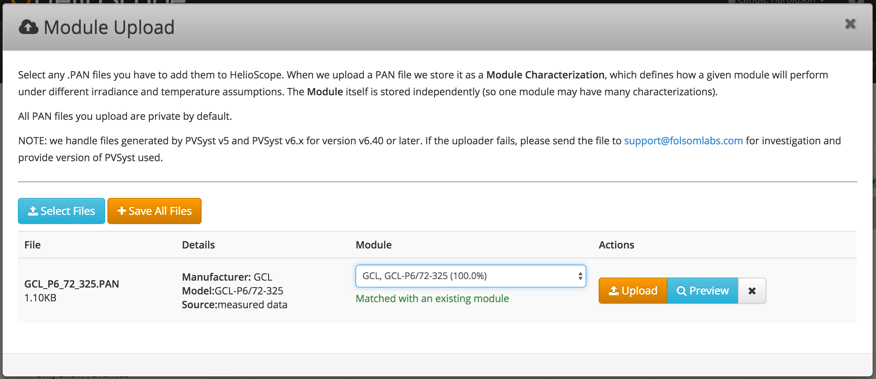

## PAN File Uploader {#pan-file-uploader}

Use the PAN file uploader to import module characterizations from PVSyst v6.4 or later.

1.  Click “Select Files” to browse and select PAN files. These can also be dragged into the browser
2.  The characterizations are automatically matched to modules in the database if they already exist. Suggestions for similar modules will appear, but new modules can be created as well
3.  View drop down menu to choose or confirm the module used
4.  If no match is found, a new module will be created
5.  Click Preview to view and edit the characterization details
6.  Users can upload files to add them to a personal database

