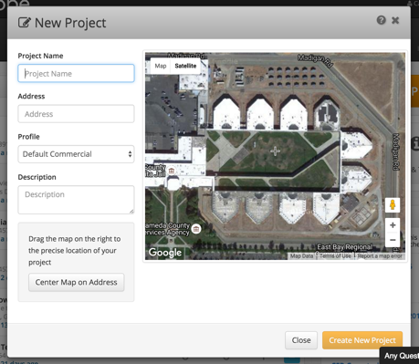
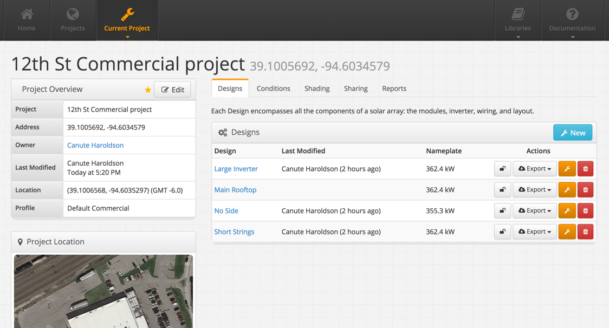

## Create Project {#create-project}

A new Project only requires a name and location/address. The Address can be defined by a street address, landmark, or latitude-longitude coordinate (in decimal format). Be sure to center the map on the area that the system will be designed and select “Create New Project”.

A Project consists of several elements:

1.  **Designs** and **Condition Sets** are the core aspects of modeling, and the resulting **Reports** are stored within the Project
2.  **Shading** can be used to load horizon profiles from Solmetric or SketchUp
3.  **Sharing** allows the owner of a project to share their project and control user access

