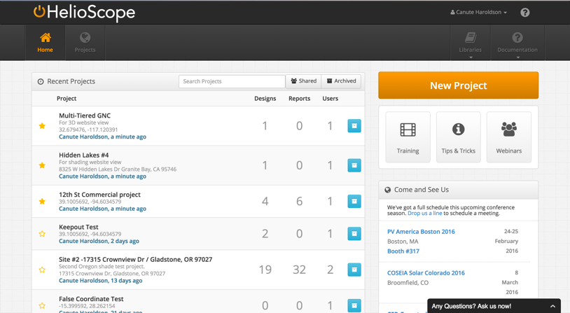

## Project List {#project-list}

The HelioScope home page shows a project list and a link to create a new project.

1.  Project list, in order of last modified project
2.  Starred projects are at the top of the list
3.  The number of Designs, Reports, and users for each Project
4.  Archive or Unarchive a project
5.  Create a new project