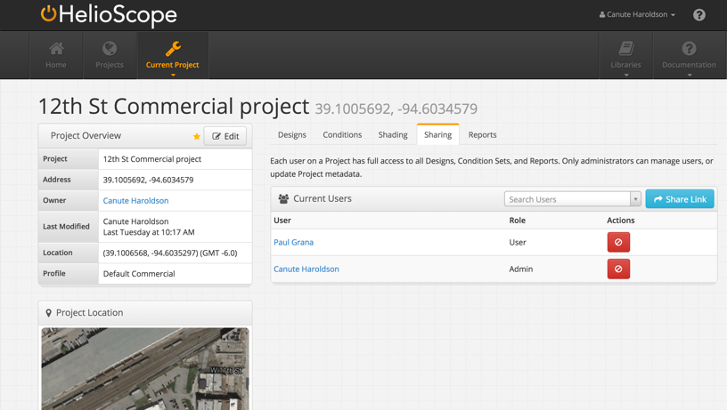
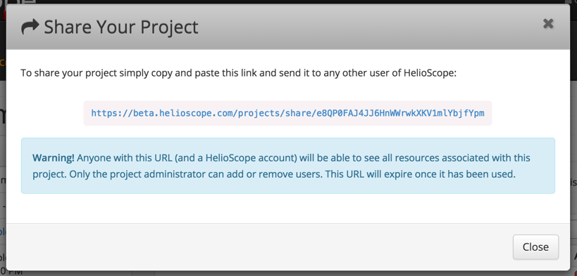

# Project Sharing {#project-sharing}

HelioScope enables sharing at the project level. Users have full access to the project, including read/write access to Designs and Reports.

Sharing is controlled under the “Sharing” tab:

1.  Button to generate a share link
2.  Users list
3.  Button to remove users from the project
4.  Share links appear in a pop-up window. Copy and send this link to collaborators to share your project (they must have an active HelioScope account to view the project).