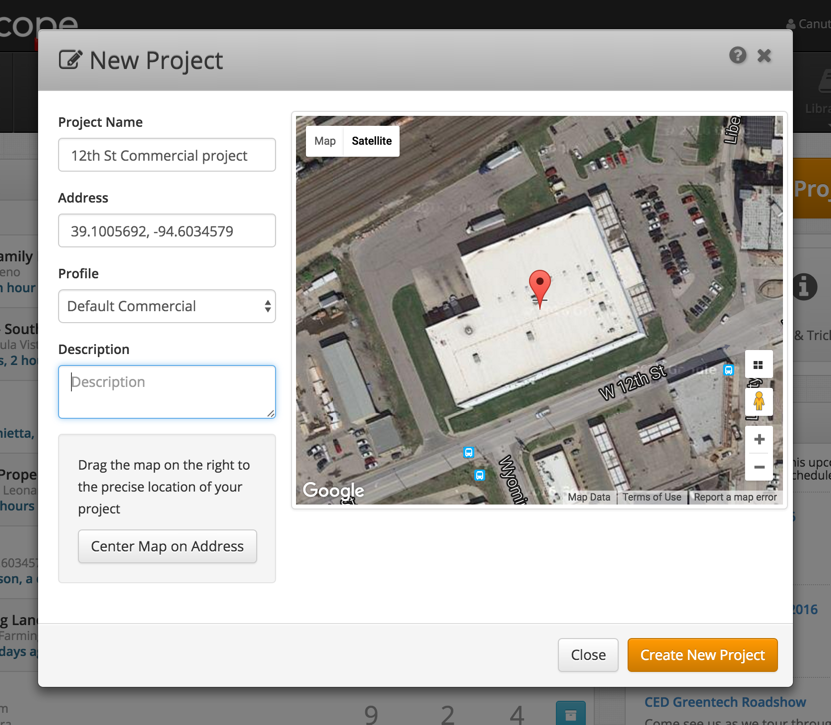
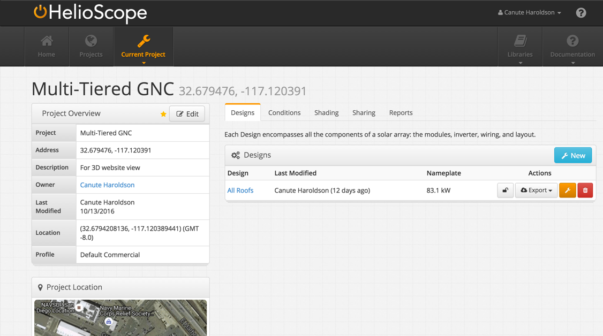
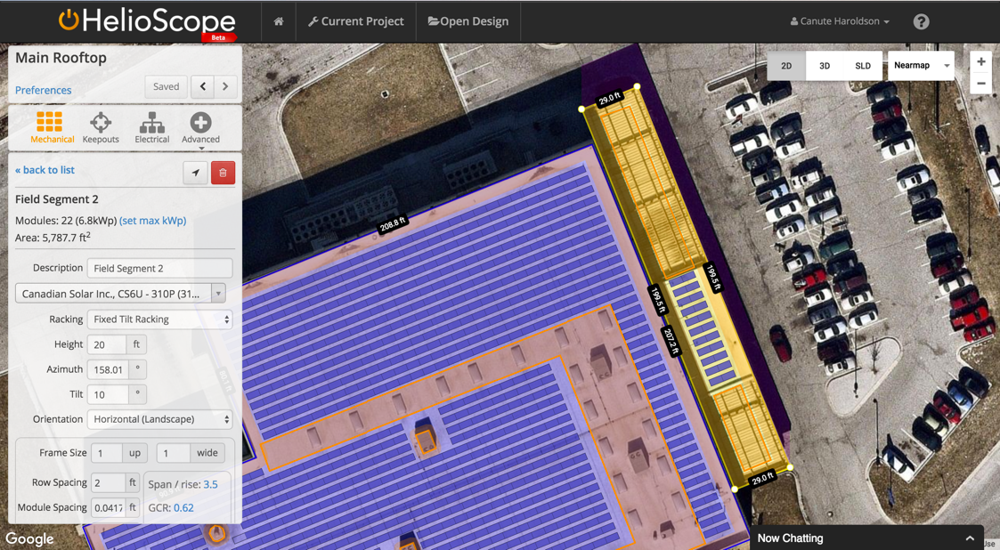
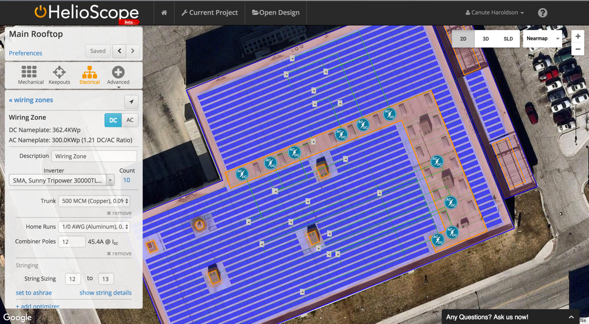
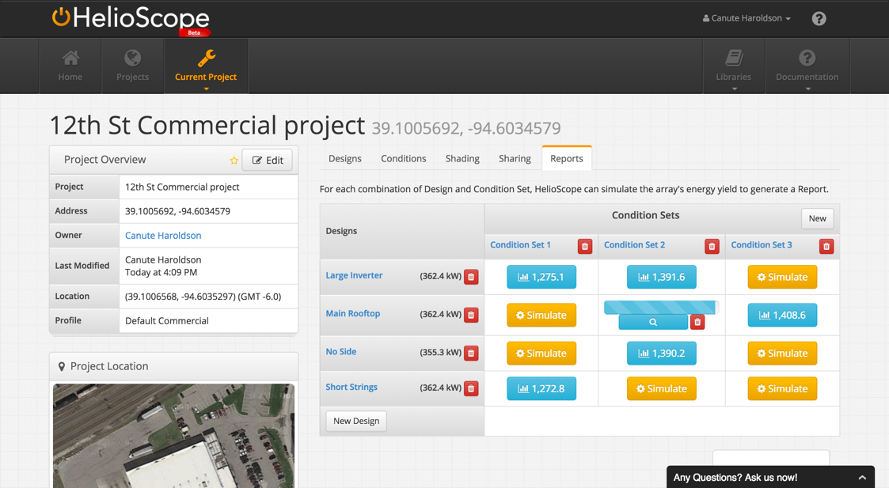

# Quick-Start Guide {#quick-start-guide}

The three major steps for creating your first project in HelioScope:

1) Create Project

2a) Create Design (Mechanical)

2b) Create Design (Electrical)

3) Run Simulation and View Report

**_Hint_**: Can adjust map position to center on specific location

Select location using street address or latitude-longitude

1: Create Project

(optional) Edit Condition Set

2: Create Design (Mechanical and Electrical)

3: Run Simulation &amp; View Report

2a: Create Design (Mechanical)

Draw Field Segment on map by clicking corners to create shape

**_Hint:_ **Can create multiple Field Segments

Define system wiring rules

**_Hint:_ **Inverters and combiner boxes can be moved by dragging to a new location

2b: Create Design (Electrical)

**_Hint:_** Can compare all reports using summary metrics

3: Run Simulation