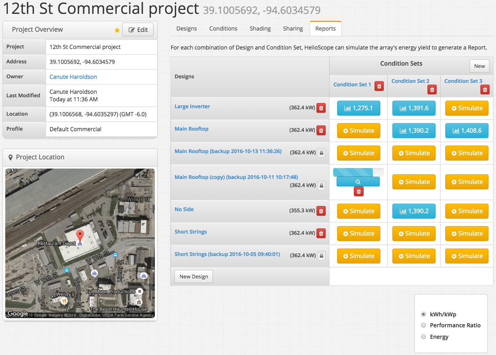

# Reports {#reports}

The reports tab shows the full set of Designs and Condition sets that have been created for a Project. Each combination of a Design and Condition Set can be simulated to create a Report.

1.  Click on the orange “Simulate” button to trigger a simulation. The mechanical and electrical design must have been completed to allow a simulation.
2.  The blue progress bar shows the status of active simulations, and how far they are away from completion
3.  Completed Reports are shown with a blue button. Click to view the detailed Report
4.  The metric shown on the completed Reports can be set to kWh/kWp, Performance Ratio, or Energy (total generation) for quick comparison between simulations.

