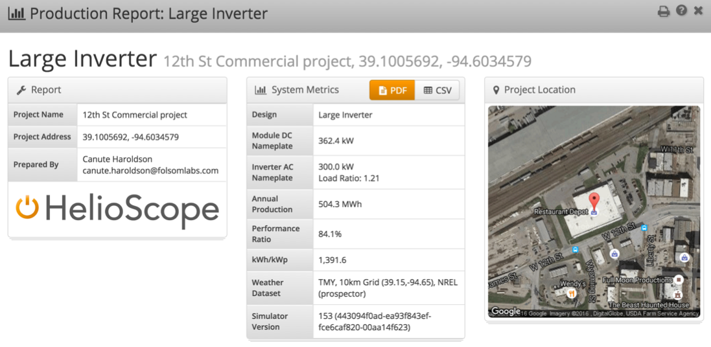
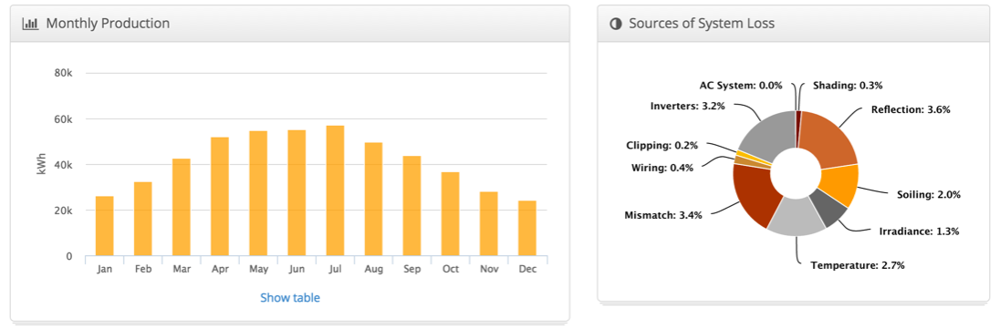
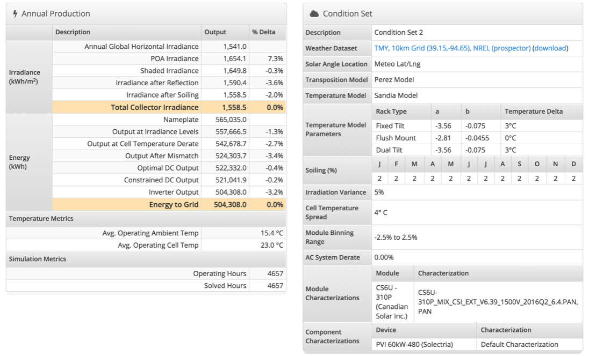
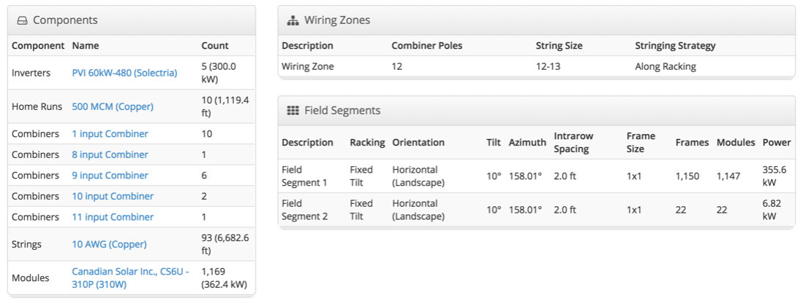
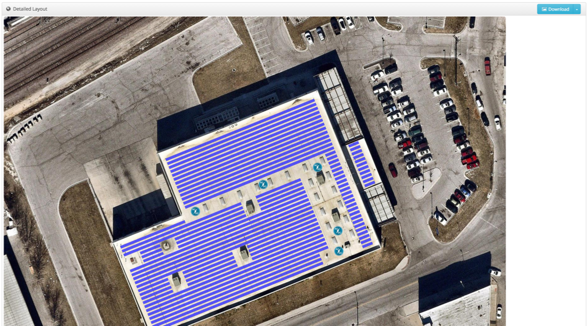

## Production Report {#production-report}

Each completed Simulation will reveal a detailed Report when clicked.

1.  Summary metrics, including energy production, performance ratio, and kWh/kWp
2.  The PDF button provides a PDF version of the report (also available via the Print icon at the top right)
3.  Click the CSV button to download an 8760 csv file for the Simulation with hourly energy results
4.  The Project Location shows a zoomed-out view of the Project region

1.  Monthly production values appear in a chart. Clicking the “Show table” text at the bottom of the Monthly Production section to show a table with the values (ideal for copy-pasting to a different program)
2.  The Sources of System Loss chart can be used for quick diagnosis of the largest loss factors in the simulation

1.  Annual Production provides a detailed loss report that shows the total losses at each step of the irradiance and energy calculations
2.  The Condition Set contains the record of assumptions made for the condition set in the report

1.  “Components” shows a bill of materials including modules, wiring, combiners, and inverters
2.  Wiring Zones list out the different wiring zones and their electrical design assumptions
3.  Field Segments list out the different field segments and their mechanical design assumptions

1.  The Detailed Layout has a high resolution image of the system, and can be modified and downloaded using the dropdown menu in the top right of the section

